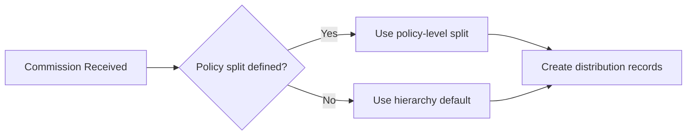

# How commission splits are calculated

When a carrier pays a commission on a policy, AMS+ distributes that money among the agents in the policy's hierarchy according to the split rules defined on the policy.

---

## The split rules

Every policy has a hierarchy — a list of agents, each with a percentage. The percentages must sum to 100% before the policy can become active.

When a commission payment arrives, the platform multiplies the payment amount by each agent's percentage and creates a distribution record for each agent.

**Example:** A $1,000 commission with a 70/30 split produces $700 for the writing agent and $300 for their managing agent.

## Where splits come from

Splits can be set at two levels, applied in order:

1. **Policy-level split** — set explicitly on the policy record. Takes precedence over everything else.
2. **Hierarchy default** — the default split for the writing agent's agency hierarchy. Used when no policy-level split is defined.

## Renewals and split changes

When a policy renews, it uses the split that was active at renewal time — not the current default. Changing the hierarchy default after a policy is issued doesn't affect existing policies until they next renew.

## What happens when splits don't add up to 100%

The platform enforces 100% totals. If a policy's splits don't sum to 100%, it's held in `pending-splits` status and the writing agent receives an alert. The commission payment is held until the split is corrected.

---

## Why this matters

Commission splits directly determine agent income. Errors here create reconciliation work and affect agent trust in the platform.

## Related pages

- [Commissions overview](overview.md)
- [Commission reconciliation](reconciliation.md)
