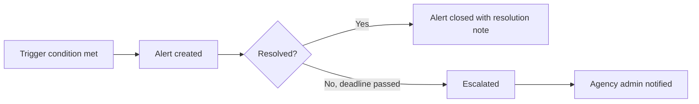

# Compliance — overview

AMS+ includes compliance tooling that helps agencies meet their regulatory obligations — primarily around Errors & Omissions (E&O) documentation requirements and CMS rules for Medicare-related products. This page explains what the compliance area covers and why it matters.

!!! warning "High-risk area"
    Compliance documentation affects regulatory and legal obligations. Changes to pages in this area require review by both the compliance team and legal.

## What compliance means in AMS+

Insurance agencies face two main categories of compliance requirements:

**E&O (Errors & Omissions)** — agencies must maintain complete, accurate client and policy records to protect themselves from professional liability claims. AMS+ flags policies that are missing required fields before their effective date.

**CMS rules** — agents selling Medicare Advantage and Part D plans are subject to Centers for Medicare & Medicaid Services regulations, including rules around scope-of-appointment documentation, enrollment timing windows, and required disclosures.

## How AMS+ surfaces compliance issues

AMS+ generates compliance alerts when:

- A policy is approaching its effective date and required fields are missing.
- A Medicare policy enrollment falls outside an allowed enrollment window.
- A scope-of-appointment document is missing or expired for a client appointment.
- A carrier sync reports a status mismatch between AMS+ and the carrier's system.

Alerts appear in the agency's compliance dashboard and can trigger email notifications to the responsible agent.

## The compliance alert lifecycle

An alert is closed when the underlying condition is resolved — the missing field is filled in, the document is uploaded, or the issue is manually acknowledged by an admin with a reason code.

## Relationship to ConfigCat flags

Some compliance rules are gated behind feature flags. For example, real-time CMS sync (`cms-real-time-sync`) is currently in staged rollout. Pages in this area will note when a described behavior is behind a flag and not yet live for all agencies.

## Why this matters

Unresolved compliance issues can result in carrier deactivation, CMS sanctions, or E&O claims — keeping this area accurate and current is a legal and financial obligation for the agencies using AMS+.

## Related pages

- [Policies — overview](../policies/overview.md)
- [How commission splits are calculated](../commissions/how-it-works.md)
