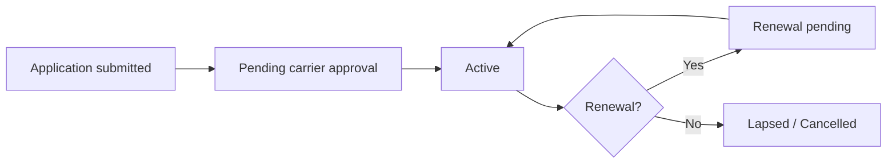

# Policies — overview

A policy in AMS+ represents an insurance contract between a carrier and a client. This page explains what a policy record contains, how it moves through its lifecycle, and why the policies area is central to almost everything else in AMS+.

## What a policy is

When an agency submits an application to a carrier and it is approved, a policy is created in AMS+. The policy record is the system's authoritative record of:

- **Who is covered** — the enrolled client(s) and their effective dates.
- **What is covered** — the plan type, carrier, and benefit package.
- **Who sold it** — the writing agent and any managing agents in the hierarchy.
- **How it pays** — the commission schedule and split percentages.

Every other area in AMS+ — commissions, compliance, reporting — works from policy data. A policy record that is incomplete or miscategorized will cause downstream problems in all of these areas.

## The policy lifecycle

- **Pending** — the application has been submitted but the carrier has not yet confirmed coverage. No commissions are generated in this state.
- **Active** — coverage is in force. Commission schedules are active. Compliance alerts may fire.
- **Renewal pending** — the policy is approaching its anniversary date. The agency has the opportunity to review and re-submit.
- **Lapsed / Cancelled** — coverage has ended. Historical commission records are retained.

## Why policies and carriers are linked

Every policy must be linked to a carrier record. The carrier record determines:

- Which commission schedule applies (carriers pay different rates for different plan types).
- Which compliance rules fire (CMS-regulated carriers have different E&O requirements).
- Which carrier sync integration is active (some carriers send real-time status updates).

## Why this matters

Accurate policy records are the foundation of accurate commissions, compliant client files, and reliable reporting — errors at the policy level compound across every downstream system.

## Related pages

- [How commission splits are calculated](../commissions/how-it-works.md)
- [E&O compliance alerts](../compliance/overview.md)
