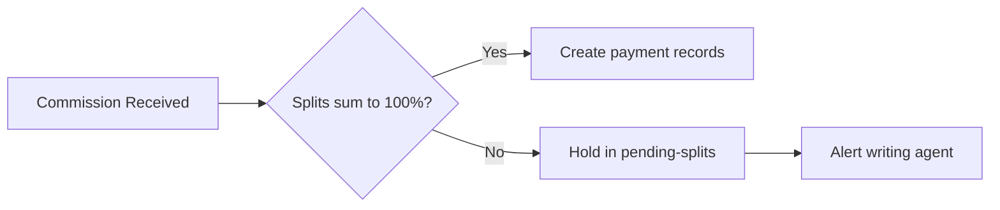

# How commission splits are calculated

When a carrier pays a commission on a policy, AMS+ distributes that money among the agents in the policy's hierarchy. This page explains the rules that govern how those splits work.

---

## The basic idea

Every policy in AMS+ has an agent hierarchy attached to it — a list of agents, each with a percentage. When a commission payment arrives from the carrier, the platform multiplies the total amount by each agent's percentage and creates a separate payment record for each.

**Example:** A $1,000 commission on a Medicare Advantage policy with a 70/30 split between a writing agent and their managing agent produces two payment records: $700 to the writing agent and $300 to the managing agent.

## How splits are set

Splits are defined at two levels:

**Policy-level split** — set when the policy is created or renewed. This is the most common case and overrides any defaults.

**Hierarchy default** — if no policy-level split is set, the platform falls back to the split defined on the agency hierarchy. This default applies to all new policies under that hierarchy unless explicitly overridden.

When a policy renews, it inherits the split that was active at the time of renewal, not the current default. This means split changes made after a policy is issued don't retroactively affect outstanding commissions.

## What happens when splits don't add up to 100%

The platform enforces that splits must sum to exactly 100% before a policy can move to `active` status. If they don't, the policy is held in `pending-splits` and the writing agent receives an alert.

## Why this matters

Agents depend on commission splits being calculated correctly — errors here directly affect income and create reconciliation work for the agency.

## Related pages

- [Reconciliation: resolving commission discrepancies](../explanation/commissions/reconciliation.md)
- [Policy record fields](../reference/record-types/policy.md)
